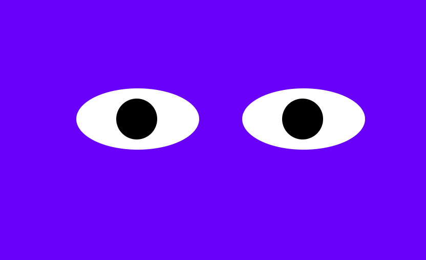

# eyes
## Eyes exercise

Eye movement project
This is an exercise developed during MIT xPro Professional Certificate in Coding: Full Stack Development with MERN. It's about to adding a second "eye" element and have that element follow the mouse position on the screen using the mouse events.

## Installation 🔧

To install this project in your machine, follow these steps:

1. Download or clone the repository
2. Go to content folder and add it to your code editor tool
3. Open eyes.html on your chrome browser to see eye movement

## Run 🚀
1. Element follow the mouse position on the screen using the mouse events.

## Roadmap 🗺

1. Responsive support
2. The mouse movement event is used to update the position of the "eye" element displayed on the page

## License information 👨‍⚖️

Copyright (c) 2022 Shilrj

Permission is hereby granted, free of charge, to any person obtaining a copy
of this software and associated documentation files (the "Software"), to deal
in the Software without restriction, including without limitation the rights
to use, copy, modify, merge, publish, distribute, sublicense, and/or sell
copies of the Software, and to permit persons to whom the Software is
furnished to do so, subject to the following conditions:

The above copyright notice and this permission notice shall be included in all
copies or substantial portions of the Software.

THE SOFTWARE IS PROVIDED "AS IS", WITHOUT WARRANTY OF ANY KIND, EXPRESS OR
IMPLIED, INCLUDING BUT NOT LIMITED TO THE WARRANTIES OF MERCHANTABILITY,
FITNESS FOR A PARTICULAR PURPOSE AND NONINFRINGEMENT. IN NO EVENT SHALL THE
AUTHORS OR COPYRIGHT HOLDERS BE LIABLE FOR ANY CLAIM, DAMAGES OR OTHER
LIABILITY, WHETHER IN AN ACTION OF CONTRACT, TORT OR OTHERWISE, ARISING FROM,
OUT OF OR IN CONNECTION WITH THE SOFTWARE OR THE USE OR OTHER DEALINGS IN THE
SOFTWARE.

## Files 📁
- eyes
    - eyes.js
    - eyes.png
    - eyes.html
    - LICENSE
    - README.md
    - styles.css
